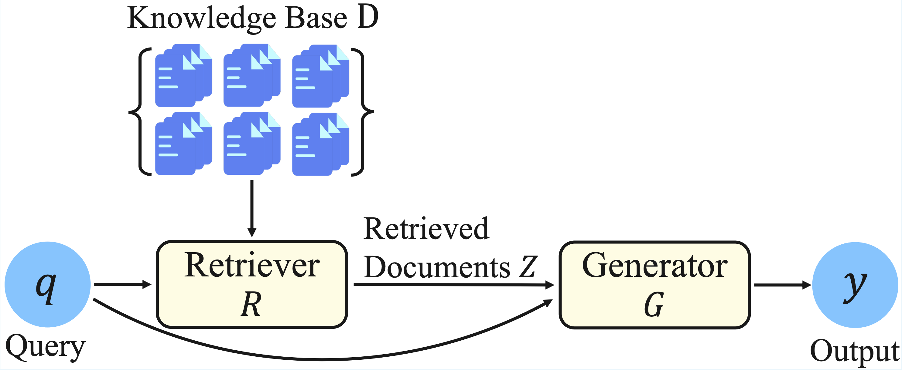
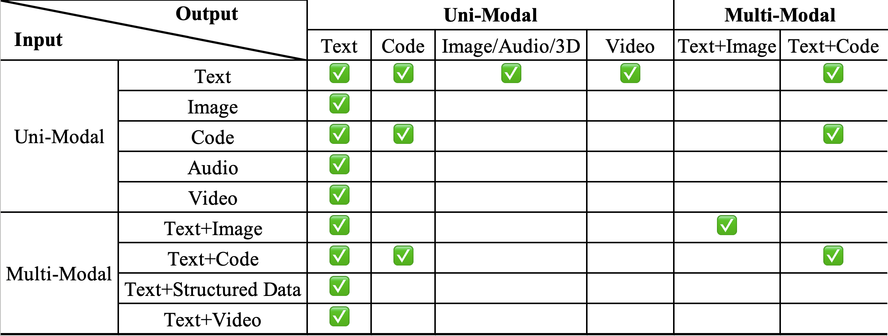
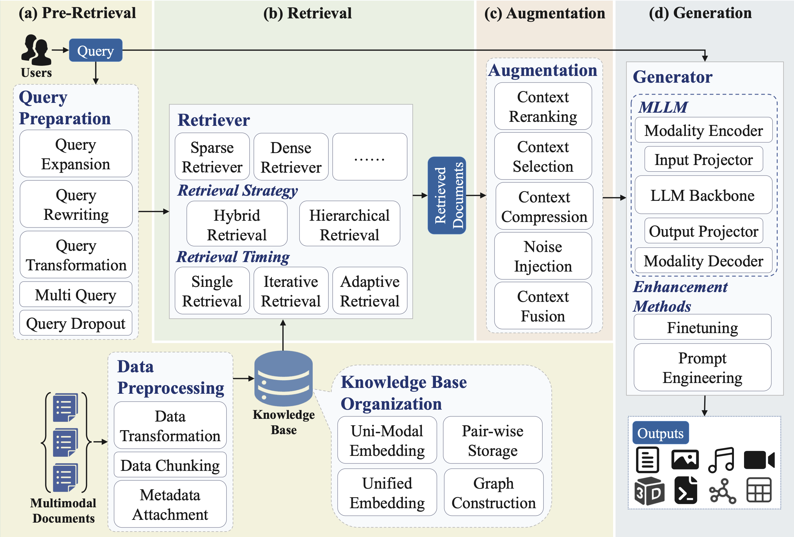
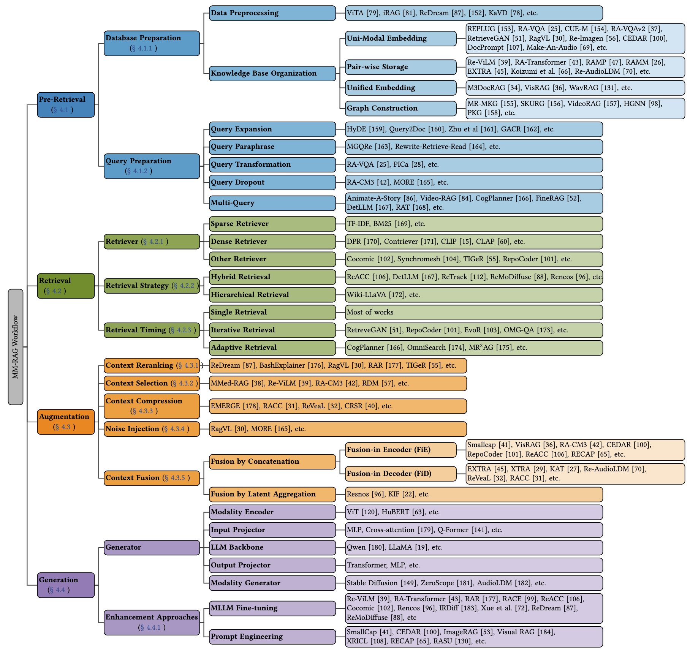
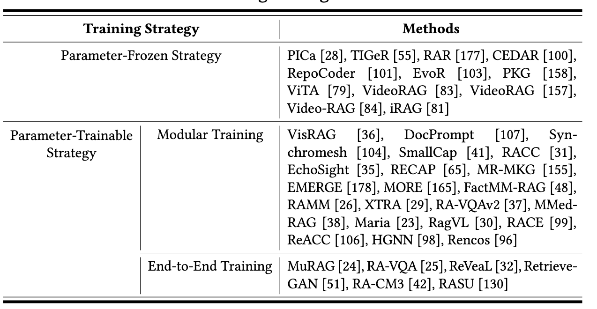
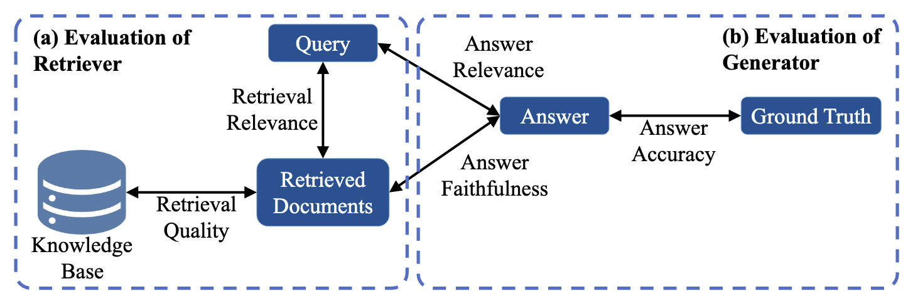

<h1 align="center">Awesome Multimodal RAG</h1>

[<a href="https://www.techrxiv.org/doi/10.36227/techrxiv.176046306.66521015">TechRxiv</a>]

This repository is for our survey paper:

> **[A Comprehensive Survey on Multimodal RAG: All Combinations of Modalities as Input and Output](https://doi.org/10.36227/techrxiv.176046306.66521015/v1)**  
> *[Rui Zhang](https://www.ruizhang.info/)1, [Chen Liu](https://sdnylc.github.io/)1, [Yixin Su](https://ethanmock.github.io/yixinsu.github.io/)1, [Ruixuan Li](https://idc.hust.edu.cn/rxli/index.htm)1, , [Xuanjing Huang](https://xuanjing-huang.github.io/)2, [Xuelong Li](http://xuelongli.cn/en.php)3, Philip S. Yu2, *  
> 1Huazhong University of Science and Technology, 2Fudan University, 3Institute of Artificial Intelligence (TeleAI) of China Telecom, 4University of Illinois at Chicago 

In this paper, we conduct a comprehensive survey of the most recent work on Multimodal RAG (MM-RAG) in the sense that it has a full coverage of almost all the combinations of modalities as input and output, whereas existing survey papers typically focus on one or two modalities. Based on different input-output modality combinations, we present a taxonomy of MM-RAG methods which gives us a much clearer picture of their key technical components.

Facilitated by such a taxonomy, we identify four essential stages of the workflow of MM-RAG, summarize common approaches to each stage, and discuss optimization strategies for each modality.

To provide a holistic understanding and practical guidance for building MM-RAG systems, we also discuss training strategies and evaluation methods of MM-RAG. Finally, we discuss various MM-RAG applications and future directions.

### Contributing

The survey and the repository are **still work in progress** and will be updated regularly. 

🙋 If you would like to include your paper in this survey and repository, please feel free to submit a pull request or open an issue with the paper's title and a brief summary highlighting its key techniques. You can also contact us via email. Please let us know if you find out a mistake or have any suggestions! We greatly appreciate your feedback regarding this repository or survey!

🌟 If you find this resource helpful for your work, please consider citing our [research](#citation).

---

## Quick Index

- [Definition — What's MM-RAG](#definition)

- [Taxonomy — MM-RAG Methods](#taxonomy)

- [Workflow — MM-RAG Stages](#workflow)
  - [Pre-Retrieval](#pre-retrieval)
  - [Retrieval](#retrieval)
  - [Augmentation](#augmentation)
  - [Generation](#generation)

- [Training Strategy](#training-strategy)

- [Evaluation](#evaluation)

---
