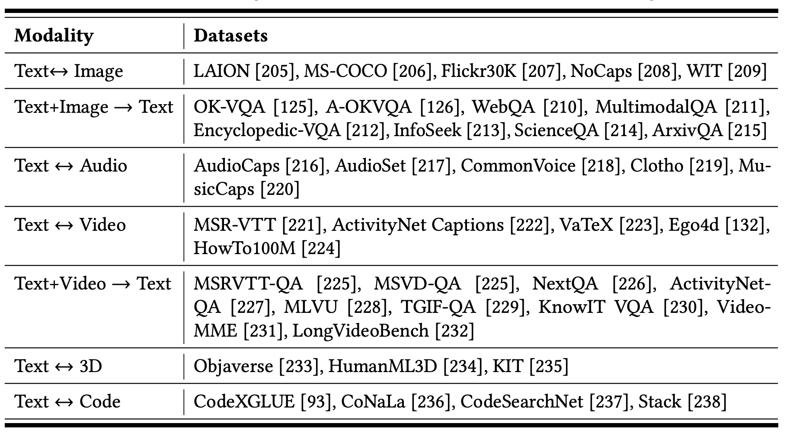

<h1 align="center">Awesome MM-RAG</h1>

<p align="center">
  
  
  
  
  
  <a href="https://doi.org/10.36227/techrxiv.176341513.38473003/v1">
    
  </a>
</p>

<div align="center">
[<a href="https://doi.org/10.36227/techrxiv.176341513.38473003/v1">TechRxiv</a>]
</div>
This repository is for our survey paper:

> **[A Comprehensive Survey on Multimodal RAG: All Combinations of Modalities as Input and Output](https://doi.org/10.36227/techrxiv.176046306.66521015/v1)** 
>
> [Rui Zhang](https://www.ruizhang.info/)<sup>1</sup>, [Chen Liu](https://sdnylc.github.io/)<sup>1</sup>, [Yixin Su](https://ethanmock.github.io/yixinsu.github.io/)<sup>1</sup>, [Ruixuan Li](https://idc.hust.edu.cn/rxli/index.htm)<sup>1</sup>, [Xuanjing Huang](https://xuanjing-huang.github.io/)<sup>2</sup>, [Xuelong Li](http://xuelongli.cn/en.php)<sup>3</sup>, Philip S. Yu<sup>4</sup> 
>
> <sup>1</sup>Huazhong University of Science and Technology, <sup>2</sup>Fudan University, <sup>3</sup>Institute of Artificial Intelligence (TeleAI) of China Telecom, <sup>4</sup>University of Illinois at Chicago 


📚 In this paper, we conduct a comprehensive survey of the most recent work on **Multimodal RAG (MM-RAG)** in the sense that it has a full coverage of almost all the combinations of modalities as input and output, whereas existing survey papers typically focus on one or two modalities. Based on different input-output modality combinations, we present a **taxonomy** of MM-RAG methods which gives us a much clearer picture of their key technical components.

⚙️ Facilitated by such a taxonomy, we identify **four essential stages** of the workflow of MM-RAG, summarize common approaches to each stage, and discuss **optimization strategies** for each modality.

🌐 To provide a **holistic understanding** and practical guidance for building MM-RAG systems, we also discuss **training strategies** and **evaluation methods** of MM-RAG. Finally, we discuss various **MM-RAG applications** and **future directions**.

---

<a name="readme-index"></a>

## Quick Index

- [Taxonomy](#Taxonomy) (from a perspective of different input-output modality combinations)


- [Workflow](#Workflow) (including Pre-Retrieval, Retrieval, Augmentation, Generation)

- [Training Strategy](#Training-strategy) (including Parameter-Frozen Strategy, Parameter-Trainable Strategy)

- [Evaluation and Benchmarks](#Evaluation-and-Benchmarks) (including Evaluaton Metrics and Benchmarks)


---

## Taxonomy

<p align="center">

</p>

### Image→Text

| Paper                                                        | Task             | Code                                                         |
| ------------------------------------------------------------ | ---------------- | ------------------------------------------------------------ |
| []()<br/>Re-vilm: Retrievalaugmented visual language model for  zero and few-shot image captioning [[paper]](https://arxiv.org/abs/2302.04858) | Image Captioning |                                                              |
| Cross-modal retrieval and semantic refinement for  remote sensing image captioning [[paper]](https://www.mdpi.com/2072-4292/16/1/196) | Image Captioning |                                                              |
| []()<br/>Smallcap: lightweight image captioning prompted with  retrieval augmentation [[paper]](https://arxiv.org/abs/2209.15323) | Image Captioning | <br/>[[Code]](https://github.com/RitaRamo/smallcap) |
| []()<br/>Retrieval-augmented multimodal language modeling [[paper]](https://arxiv.org/abs/2211.12561) | Image Captioning |                                                              |
| []()<br/>Retrieval-augmented transformer for image captioning [[paper]](https://arxiv.org/abs/2207.13162) | Image Captioning |                                                              |
| []()<br/>Memory-augmented image captioning [[paper]](https://arxiv.org/abs/2403.03715) | Image Captioning |                                                              |
| []()<br/>Retrieval-augmented image captioning [[paper]](https://arxiv.org/abs/2302.08268) | Image Captioning |                                                              |
| []()<br/>Deltanet: Conditional medical report generation for  COVID-19 diagnosis [[paper]](https://aclanthology.org/2022.coling-1.261/) | Image Captioning |                                                              |
| Retrieval-enhanced adversarial training with dynamic  memory-augmented attention for image paragraph captioning [[paper]](https://www.sciencedirect.com/science/article/abs/pii/S0950705120308595) | Image Captioning | <br/>[[Code]](https://github.com/anonymous-caption/RAMP) |
| []()<br/>Fact-aware multimodal retrieval augmentation for  accurate medical radiology report generation [[paper]](https://arxiv.org/abs/2407.15268) | Image Captioning | <br/>[[Code]](https://github.com/cxcscmu/FactMM-RAG) |
| []()<br/>Retrieval, analogy, and composition: A framework for  compositional generalization in image captioning [[paper]](https://aclanthology.org/2021.findings-emnlp.171/) | Image Captioning |                                                              |

<p align="right" style="font-size: 14px; color: #555; margin-top: 20px;">
    <a href="#readme-index" style="text-decoration: none; color: #007bff; font-weight: bold;">
        ↑ Back to Index ↑
    </a>
</p>

### Text→Image

| Paper                                                        | Task             | Code                                                         |
| ------------------------------------------------------------ | ---------------- | ------------------------------------------------------------ |
| []()<br/>RetrieveGAN:   Image Synthesis via Differentiable Patch Retrieval  [[paper]](https://arxiv.org/abs/2007.08513) | Image Generation |                                                              |
| []()<br/>FineRAG:   Fine-grained Retrieval-Augmented Text-to-Image Generation [[paper]](https://aclanthology.org/2025.coling-main.741.pdf) | Image Generation |                                                              |
| ImageRAG:   Dynamic Image Retrieval for Reference-Guided Image Generation [[paper]](https://arxiv.org/abs/2502.09411) | Image Generation | <br/>[[Code]](https://github.com/rotem-shalev/ImageRAG) |
| X&Fuse:   Fusing Visual Information in Text-to-Image Generation [[paper]](https://arxiv.org/abs/2303.01000) | Image Generation |                                                              |
| []()<br/>TIGeR:   Unifying Text-to-Image Generation and Retrieval with Large Multimodal Models  [[paper]](https://arxiv.org/abs/2406.05814) | Image Generation | <br/>[[Code]](https://github.com/LgQu/TIGeR) |
| []()<br/>Re-Imagen:   Retrieval-Augmented Text-to-Image Generator  [[paper]](https://arxiv.org/abs/2209.14491) | Image Generation |                                                              |
| []()<br/>Retrieval-augmented   diffusion models [[paper]](https://proceedings.neurips.cc/paper_files/paper/2022/file/62868cc2fc1eb5cdf321d05b4b88510c-Paper-Conference.pdf) | Image Generation | <br/>[[Code]](https://github.com/CompVis/retrieval-augmented-diffusion-models) |
| []()<br/>KNN-Diffusion:   Image Generation via Large-Scale Retrieval [[paper]](https://arxiv.org/abs/2204.02849) | Image Generation |                                                              |
| []()<br/>Memory-Driven Text-to-Image Generation [[paper]](https://arxiv.org/abs/2208.07022) | Image Generation |                                                              |

<p align="right" style="font-size: 14px; color: #555; margin-top: 20px;">
    <a href="#readme-index" style="text-decoration: none; color: #007bff; font-weight: bold;">
        ↑ Back to Index ↑
    </a>
</p>

### Text+Image→Text

| Paper                                                        | Task          | Code                                                         |
| ------------------------------------------------------------ | ------------- | ------------------------------------------------------------ |
| []()<br/>Augmenting Transformers with KNN-Based Composite  Memory for Dialog [[paper]](https://arxiv.org/abs/2004.12744) | Visual Dialog |                                                              |
| []()<br/>Maria: A Visual Experience Powered Conversational  Agent [[paper]](https://arxiv.org/abs/2105.13073) | Visual Dialog | <br/>[[Code]](https://github.com/jokieleung/Maria) |
| []()<br/>Murag: Multimodal retrieval-augmented generator for  open question answering over images and text [[paper]](https://arxiv.org/abs/2210.02928) | Visual QA     |                                                              |
| []()<br/>Retrieval Augmented Visual Question Answering with  Outside Knowledge [[paper]](https://arxiv.org/abs/2210.03809) | Visual QA     | <br/>[[Code]](https://github.com/LinWeizheDragon/Retrieval-Augmented-Visual-Question-Answering) |
| []()<br/>RAMM: Retrieval-augmented Biomedical Visual Question  Answering with Multi-modal Pre-training [[paper]](https://arxiv.org/abs/2303.00534) | Visual QA     | [<br/>[Code]](http://github.com/GanjinZero/RAMM) |
| []()<br/>KAT: A Knowledge Augmented Transformer for  Vision-and-Language [[paper]](https://arxiv.org/abs/2112.08614) | Visual QA     | <br/>[[Code]](https://github.com/guilk/KAT) |
| []()<br/>An empirical study of gpt-3 for few-shot  knowledge-based vqa [[paper]](https://arxiv.org/abs/2109.05014) | Visual QA     | <br/>[[Code]](https://github.com/microsoft/PICa) |
| []()<br/>Cross-modal retrieval augmentation for multi-modal  classification [[paper]](https://arxiv.org/abs/2104.08108) | Visual QA     |                                                              |
| Mllm is a strong reranker: Advancing multimodal  retrieval-augmented generation via knowledge-enhanced reranking and  noise-injected training [[paper]](https://arxiv.org/abs/2407.21439) | Visual QA     | [<br/>[Code]](https://github.com/DataArcTech/RagVL) |
| Learning to compress contexts for efficient  knowledge-based visual question answering [[paper]](https://arxiv.org/abs/2409.07331) | Visual QA     |                                                              |
| []()<br/>Reveal: Retrievalaugmented visual-language  pre-training with multi-source multimodal knowledge memory [[paper]](https://arxiv.org/abs/2212.05221) | Visual QA     | [[Code]](https://github.com/google-research/scenic/tree/main/scenic/projects/knowledge_visual_language) |
| []()<br/> Visa: Retrieval augmented generation with visual  source attribution [[paper]](https://arxiv.org/abs/2412.14457) | Visual QA     | <br/>[[Code]](https://github.com/castorini/visa) |
| M3DOCRAG: Multi-modal Multi-page Document RAG System [[paper]](https://arxiv.org/abs/2411.04952) | Visual QA     | <br/>[[Code]](https://github.com/bloomberg/m3docrag) |
| []()<br/>Echosight: Advancing visual-language models with wiki  knowledge [[paper]](https://arxiv.org/abs/2407.12735) | Visual QA     | <br/>[[Code]](https://github.com/Go2Heart/EchoSight) |
| Visrag: Vision-based retrieval-augmented generation on  multi-modality documents [[paper]](https://arxiv.org/abs/2410.10594) | Visual QA     | <br/>[[Code]](https://github.com/OpenBMB/VisRAG) |
| []()<br/>Fine-grained late-interaction multi-modal retrieval  for retrieval augmented visual question answering [[paper]](https://arxiv.org/abs/2309.17133) | Visual QA     | <br/>[[Code]](https://github.com/LinWeizheDragon/Retrieval-Augmented-Visual-Question-Answering) |
| []()<br/>MMed-RAG: Versatile Multimodal RAG System for Medical  Vision Language Models [[paper]](https://arxiv.org/abs/2410.13085) | Visual QA     | <br/>[[Code]](https://github.com/richard-peng-xia/MMed-RAG) |

<p align="right" style="font-size: 14px; color: #555; margin-top: 20px;">
    <a href="#readme-index" style="text-decoration: none; color: #007bff; font-weight: bold;">
        ↑ Back to Index ↑
    </a>
</p>

### Audio→Text

| Paper                                                        | Task             | Code                                                         |
| ------------------------------------------------------------ | ---------------- | ------------------------------------------------------------ |
| []()<br/>RECAP:   Retrieval-Augmented Audio Captioning [[paper]](https://arxiv.org/abs/2309.09836) | Audio Captioning | <br/>[[Code]](https://github.com/Sreyan88/RECAP) |
| []()<br/>Audio   Captioning using Pre-Trained Large-Scale Language Model Guided by Audio-based   Similar Caption Retrieval [[paper]](https://arxiv.org/abs/2012.07331) | Audio Captioning |                                                              |

<p align="right" style="font-size: 14px; color: #555; margin-top: 20px;">
    <a href="#readme-index" style="text-decoration: none; color: #007bff; font-weight: bold;">
        ↑ Back to Index ↑
    </a>
</p>

### Text→Audio

| Paper                                                        | Task             | Code                                                         |
| ------------------------------------------------------------ | ---------------- | ------------------------------------------------------------ |
| []()<br/>Make-An-Audio:   Text-To-Audio Generation with Prompt-Enhanced Diffusion Models [[paper]](https://arxiv.org/abs/2301.12661) | Audio Generation | <br/>[[Code]](https://github.com/Text-to-Audio/Make-An-Audio) |
| []()<br/>Retrieval-Augmented   Text-to-Audio Generation [[paper]](https://arxiv.org/abs/2309.08051) | Audio Generation |                                                              |
| []()<br/>Audiobox   TTA-RAG: Improving Zero-Shot and Few-Shot Text-To-Audio with   Retrieval-Augmented Generation [[paper]](https://arxiv.org/abs/2411.05141) | Audio Generation | [[Code]](https://tta-rag-is25.github.io/)                    |
| []()<br/>Retrieval   augmented generation in prompt-based text-to-speech synthesis with   context-aware contrastive language-audio pretraining [[paper]](https://arxiv.org/abs/2406.03714) | Audio Generation | [[Code]](https://happylittlecat2333.github.io/interspeech2024-RAG/) |
| []()<br/>Retrieval-augmented classifier guidance for audio generation | Audio Generation |                                                              |

<p align="right" style="font-size: 14px; color: #555; margin-top: 20px;">
    <a href="#readme-index" style="text-decoration: none; color: #007bff; font-weight: bold;">
        ↑ Back to Index ↑
    </a>
</p>

### Video→Text

| Paper                                                        | Task             | Code                                                         |
| ------------------------------------------------------------ | ---------------- | ------------------------------------------------------------ |
| []()<br/>Retrieval-augmented   egocentric video captioning [[paper]](https://arxiv.org/abs/2401.00789) | Video Captioning | [<br/>[Code]](https://github.com/Jazzcharles/Egoinstructor/) |
| []()<br/>Incorporating   background knowledge into video description generation [[paper]](https://aclanthology.org/D18-1433/) | Video Captioning |                                                              |

<p align="right" style="font-size: 14px; color: #555; margin-top: 20px;">
    <a href="#readme-index" style="text-decoration: none; color: #007bff; font-weight: bold;">
        ↑ Back to Index ↑
    </a>
</p>

### Text→Video

| Paper                                                        | Task             | Code                                                         |
| ------------------------------------------------------------ | ---------------- | ------------------------------------------------------------ |
| []()<br/>Animate-A-Story:   Storytelling with Retrieval-Augmented Video Generation [[paper]](https://arxiv.org/abs/2307.06940) | Video Generation | <br/>[[Code]](https://github.com/AILab-CVC/Animate-A-Story) |

<p align="right" style="font-size: 14px; color: #555; margin-top: 20px;">
    <a href="#readme-index" style="text-decoration: none; color: #007bff; font-weight: bold;">
        ↑ Back to Index ↑
    </a>
</p>

### Image→Video

| Paper                                                        | Task                      | Code                                                         |
| ------------------------------------------------------------ | ------------------------- | ------------------------------------------------------------ |
| []()<br/>MotionRAG:   Motion Retrieval-Augmented Image-to-Video Generation [[paper]](https://arxiv.org/abs/2509.26391) | Image-to-Video Generation | <br/>[[Code]](https://github.com/MCG-NJU/MotionRAG) |

<p align="right" style="font-size: 14px; color: #555; margin-top: 20px;">
    <a href="#readme-index" style="text-decoration: none; color: #007bff; font-weight: bold;">
        ↑ Back to Index ↑
    </a>
</p>

### Video+Text→Text

| Paper                                                        | Task     | Code                                                         |
| ------------------------------------------------------------ | -------- | ------------------------------------------------------------ |
| []()<br/>ViTA:   An Efficient Video-to-Text Algorithm using VLM for RAG-based Video Analysis   System [[paper]](https://openaccess.thecvf.com/content/CVPR2024W/MAR/papers/Arefeen_ViTA_An_Efficient_Video-to-Text_Algorithm__using_VLM_for_RAG-based_CVPRW_2024_paper.pdf) | Video QA |                                                              |
| []()<br/>Retrieving-to-Answer:   Zero-Shot Video Question Answering with Frozen Large Language Models [[paper]](https://arxiv.org/abs/2306.11732) | Video QA |                                                              |
| []()<br/>iRAG:   Advancing RAG for Videos with an Incremental Approach [[paper]](https://arxiv.org/abs/2404.12309) | Video QA |                                                              |
| []()<br/>Retrieval   augmented convolutional encoder-decoder networks for video captioning [[paper]](https://dl.acm.org/doi/10.1145/3539225) | Video QA |                                                              |
| []()<br/>VideoRAG:   Retrieval-Augmented Generation over Video Corpus [[paper]](https://arxiv.org/abs/2501.05874) | Video QA | <br/>[[Code]](https://github.com/starsuzi/VideoRAG) |
| []()<br/>Video-RAG:   Visually-aligned Retrieval-Augmented Long Video Comprehension [[paper]](https://arxiv.org/abs/2411.13093) | Video QA | <br/>[[Code]](http://github.com/Leon1207/Video-RAG-master) |
| VideoRAG:   Retrieval-Augmented Generation with Extreme Long-Context Videos [[paper]](https://arxiv.org/abs/2502.01549) | Video QA | <br/>[[Code]](https://github.com/HKUDS/VideoRAG) |

<p align="right" style="font-size: 14px; color: #555; margin-top: 20px;">
    <a href="#readme-index" style="text-decoration: none; color: #007bff; font-weight: bold;">
        ↑ Back to Index ↑
    </a>
</p>

### Text→3D

| Paper                                                        | Task       | Code                                                         |
| ------------------------------------------------------------ | ---------- | ------------------------------------------------------------ |
| []()<br/>ReMoDiffuse:   Retrieval-Augmented Motion Diffusion Model [[paper]](https://arxiv.org/abs/2304.01116) | Text-to-3D | <br/>[[Code]](https://github.com/mingyuan-zhang/ReMoDiffuse) |
| []()<br/>Retrieval-Augmented   Score Distillation for Text-to-3D Generation [[paper]](http://arxiv.org/abs/2402.02972) | Text-to-3D | <br/>[[Code]](https://github.com/cvlab-kaist/ReDream) |

<p align="right" style="font-size: 14px; color: #555; margin-top: 20px;">
    <a href="#readme-index" style="text-decoration: none; color: #007bff; font-weight: bold;">
        ↑ Back to Index ↑
    </a>
</p>

### Code→Text

| Paper                                                        | Task                              | Code                                                         |
| ------------------------------------------------------------ | --------------------------------- | ------------------------------------------------------------ |
| []()<br/>Retrieval-based neural source code summarization [[paper]](https://dl.acm.org/doi/10.1145/3377811.3380383) | Code Summarization                | [<br/>[Code]](https://github.com/zhangj111/rencos) |
| []()<br/>Retrieval   augmented code generation and summarization [[paper]](https://arxiv.org/abs/2108.11601) | Code Generation and Summarization | <br/>[[Code]](https://github.com/rizwan09/REDCODER) |
| []()<br/>Retrieval-Augmented   Generation for Code Summarization via Hybrid GNN [[paper]](https://arxiv.org/abs/2006.05405) | Code Summarization                | [<br/>[Code]](https://github.com/shangqing-liu/CCSD-benchmark-for-code-summarization) |
| []()<br/>RACE:   Retrieval-Augmented Commit Message Generation [[paper]](https://arxiv.org/abs/2203.02700) | Commit Message Generation         | [<br/>[Code]](http://github.com/DeepSoftwareAnalytics/RACE) |

<p align="right" style="font-size: 14px; color: #555; margin-top: 20px;">
    <a href="#readme-index" style="text-decoration: none; color: #007bff; font-weight: bold;">
        ↑ Back to Index ↑
    </a>
</p>

### Text→Code

| Paper                                                        | Task                              | Code                                                         |
| ------------------------------------------------------------ | --------------------------------- | ------------------------------------------------------------ |
| []()<br/>Retrieval-Based Prompt Selection for Code-Related Few-Shot Learning [[paper]](https://dl.acm.org/doi/10.1109/icse48619.2023.00205) | Code Generation                   | <br/>[[Code]](https://github.com/prompt-learning/cedar) |
| []()<br/>RepoCoder:   Repository-Level Code Completion Through Iterative Retrieval and Generation [[paper]](https://arxiv.org/abs/2303.12570) | Code Completion                   | [[Code]](https://github.com/microsoft/CodeT/tree/main/RepoCoder) |
| []()<br/>Retrieval augmented code generation and summarization [[paper]](https://arxiv.org/abs/2108.11601) | Code Generation and Summarization | <br/>[[Code]](https://github.com/rizwan09/REDCODER) |
| CoCoMIC:   Code Completion By Jointly Modeling In-file and Cross-file Context [[paper]](https://arxiv.org/abs/2212.10007) | Code Generation                   | <br/>[[Code]](https://github.com/amazon-science/cocomic) |
| []()<br/>EVOR:   Evolving Retrieval for Code Generation [[paper]](https://arxiv.org/abs/2402.12317) | Code Generation                   | [[Code]](https://arks-codegen.github.io/)                    |
| []()<br/>Synchromesh:   Reliable code generation from pre-trained language models [[paper]](https://arxiv.org/abs/2201.11227) | Code Generation                   | <br/>[[Code]](https://github.com/kanishkg/synchromesh) |
| []()<br/>A Retrieve-and-Edit Framework for Predicting Structured Outputs [[paper]](https://arxiv.org/abs/1812.01194) | Code Generation                   |                                                              |
| []()<br/>ReACC: A Retrieval-Augmented Code Completion Framework [[paper]](https://arxiv.org/abs/2203.07722) | Code Completion                   | [<br/>[Code]](https://github.com/microsoft/ReACC) |
| []()<br/>DocPrompting:   Generating Code by Retrieving the Docs [[paper]](https://arxiv.org/abs/2207.05987) | Code Generation                   | [<br/>[Code]](https://github.com/shuyanzhou/docprompting) |
| []()<br/>XRICL:   Cross-lingual Retrieval-Augmented In-Context Learning for Cross-lingual Text-to-SQL Semantic Parsing [[paper]](https://arxiv.org/abs/2210.13693) | Text-to-SQL                       |                                                              |

<p align="right" style="font-size: 14px; color: #555; margin-top: 20px;">
    <a href="#readme-index" style="text-decoration: none; color: #007bff; font-weight: bold;">
        ↑ Back to Index ↑
    </a>
</p>

### Text+Structured Data→Text

| Paper                                                        | Task     | Code                                                         |
| ------------------------------------------------------------ | -------- | ------------------------------------------------------------ |
| KnowledGPT:  Enhancing Large Language Models with Retrieval and Storage Access on Knowledge Bases [[paper]](https://arxiv.org/abs/2308.11761) | KBQA     |                                                              |
| []()<br/>G-Retriever:   Retrieval-Augmented Generation for Textual Graph Understanding and Question   Answering [[paper]](https://arxiv.org/abs/2402.07630) | KBQA     | [<br/>[Code]](https://github.com/XiaoxinHe/G-Retriever) |
| []()<br/>ReTraCk:   A Flexible and Efficient Framework for Knowledge Base Question Answering[[paper]](https://aclanthology.org/2021.acl-demo.39.pdf) | KBQA     | [[Code]](https://github.com/microsoft/KC/tree/main/papers/ReTraCk) |
| []()<br/>KAG:   Boosting LLMs in Professional Domains via Knowledge Augmented Generation [[paper]](https://arxiv.org/abs/2409.13731) | KBQA     | <br/>[[Code]](https://github.com/OpenSPG/KAG) |
| []()<br/>LI-RAGE: Late   Interaction Retrieval Augmented Generation with Explicit Signals for   Open-Domain Table Question Answering [[paper]](https://aclanthology.org/2023.acl-short.133.pdf) | Table QA | <br/>[[Code]](https://github.com/amazon-science/robust-tableqa) |
| End-to-End Table Question Answering via Retrieval-Augmented Generation [[paper]](https://arxiv.org/abs/2203.16714) | Table QA |                                                              |
| RAG over Tables: Hierarchical Memory Index, Multi-Stage Retrieval, and Benchmarking [[paper]](https://arxiv.org/abs/2504.01346) | Table QA | <br/>[[Code]](https://github.com/jiaruzouu/T-RAG) |
| []()<br/>Dual Reader-Parser on Hybrid Textual and Tabular Evidence for Open Domain Question Answering [[paper]](https://arxiv.org/abs/2108.02866) | Table QA | [<br/>[Code]](https://github.com/awslabs/durepa-hybrid-qa) |

<p align="right" style="font-size: 14px; color: #555; margin-top: 20px;">
    <a href="#readme-index" style="text-decoration: none; color: #007bff; font-weight: bold;">
        ↑ Back to Index ↑
    </a>
</p>

## Workflow

For a functional MM-RAG system, we identify four essential stages of its workflow:  ***pre-retrieval, retrieval, augmentation and generation*** . Retrieval and generation involve the retriever and generator, respectively. Pre-retrieval involves knowledge base and query preparation. Augmentation involves the preprocessing of the query and retrieved documents before they are fed into the generator. For each stage, we discuss common approaches and modality-specific optimization strategies, and summarize representative studies.

<p align="center">

</p>

<p align="center">

</p>

## Training Strategy

There are mainly two strategies: parameter-frozen strategies and parameter-trainable strategies. We summarize training methods and commonly used training datasets 4 per input-output modality combination in the following Tables.

<p align="center">

</p>

<p align="center">

</p>

## Evaluation and Benchmarks

We discussed the evaluation metrics and benchmarks of the retriever and the generator as they are the two core components that affect the performance of MM-RAG.

<p align="center">

</p>

| Modality                    | Benchmark                                                    | Evaluation Targets                                           |
| --------------------------- | ------------------------------------------------------------ | ------------------------------------------------------------ |
| Text + Image → Text         | []()<br/>WebQA [[Paper]](https://arxiv.org/abs/2109.00590) [[Resource]](https://webqna.github.io/) | Textual knowledge retrieval and reasoning.                   |
|                             | []()<br/>OK-VQA [[Paper]](https://arxiv.org/abs/1906.00067)  [[Resource]](https://okvqa.allenai.org/) |                                                              |
|                             | []()<br/>A-OKVQA [[Paper]](https://arxiv.org/abs/2206.01718) [[Resource]](https://github.com/allenai/aokvqa) |                                                              |
|                             | []()<br/>MRAG-BENCH  [[Paper]](https://arxiv.org/abs/2410.08182) [[Resource]](https://mragbench.github.io/) | Visual knowledge retrieval and reasoning.                    |
|                             | Visual-RAG [[Paper]](https://arxiv.org/abs/2502.16636) [[Resource]](https://github.com/visual-rag/visual-rag) |                                                              |
|                             | $M^2$RAG [[Paper]](https://arxiv.org/abs/2411.16365) [[Resource]](https://github.com/maziao/M2RAG) | Document retrieval and generation with interleaved text-image content. |
|                             | []()<br/>MRAMG-Bench  [[Paper]](https://arxiv.org/abs/2502.04176) [[Resource]](https://github.com/MRAMG-Bench/MRAMG) |                                                              |
|                             | Dyn-VQA [[Paper]](https://arxiv.org/abs/2411.02937) [[Resource]](https://github.com/Alibaba-NLP/OmniSearch) | Ability of adapting to rapidly changing multimodal knowledge; multi-hop and multimodal reasoning. |
|                             | []()<br/>CogBench [[Paper]](https://arxiv.org/abs/2501.15470) | Adaptive information acquisition by recording the entire planning procedure. |
|                             | Liu et al. [[Paper]](https://arxiv.org/abs/2502.17297)  [[Resource]](https://github.com/NEUIR/M2RAG) | Evaluates MM-RAG across four tasks: image captioning, multimodal QA, fact verification, and image reranking. |
| Text + Table + Image → Text | []()<br/>OMG-QA [[Paper]](https://aclanthology.org/2024.emnlp-industry.75/) | Retrieval and reasoning over complex document structures.    |
|                             | []()<br/>PDF-MVQA [[Paper] [[Resource]](https://github.com/adlnlp/mmvqa) |                                                              |
|                             | Real-MM-RAG [[Paper]](https://arxiv.org/abs/2502.12342)      |                                                              |
| Text → Text                 | []()<br/>RAGAS [[Paper]](https://arxiv.org/abs/2309.15217) [[Resource]](https://github.com/explodinggradients/ragas) | Context relevance, answer faithfulness, and answer relevance. |
|                             | []()<br/>ARES [[Paper]](https://arxiv.org/abs/2311.09476) [[Resource]](https://github.com/stanford-futuredata/ARES) |                                                              |
|                             | []()<br/>RGB [[Paper]](https://arxiv.org/abs/2309.01431) [[Resource]](https://github.com/chen700564/RGB) | Noise robustness, negative rejection, information integration, and counterfactual robustness |

<p align="right" style="font-size: 14px; color: #555; margin-top: 20px;">
    <a href="#readme-index" style="text-decoration: none; color: #007bff; font-weight: bold;">
        ↑ Back to Index ↑
    </a>
</p>

## Contributing and Citation

The survey and the repository are **still work in progress** and will be updated regularly. 

🙋 If you would like to include your paper in this survey and repository, please feel free to submit a pull request or open an issue with the paper's title and a brief summary highlighting its key techniques. You can also contact us via email. Please let us know if you find out a mistake or have any suggestions! We greatly appreciate your feedback regarding this repository or survey!

🌟 If you find this resource helpful for your work, please consider citing our research.
```
@article{Zhang_2025,
	title={A Comprehensive Survey on Multimodal RAG: All Combinations of Modalities as Input and Output},
	url={http://dx.doi.org/10.36227/techrxiv.176341513.38473003/v2},
	DOI={10.36227/techrxiv.176341513.38473003/v2},
	publisher={IEEE},
	author={Rui Zhang and Chen Liu and Yixin Su and Ruixuan Li and Xuanjing Huang and Xuelong Li and Philip S Yu},
	year={2025},
	month=nov
}
```

